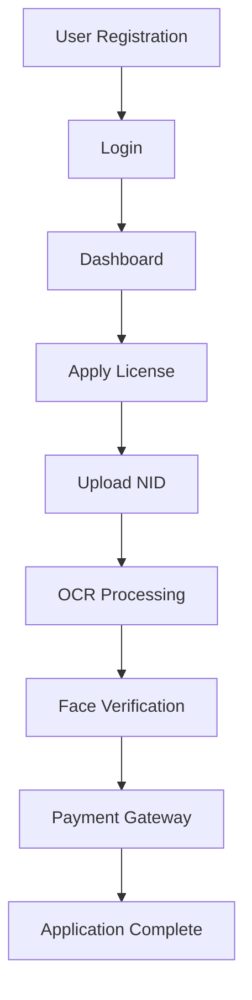
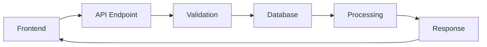

# Project Structure

## 📁 BRTA Mobile Application Architecture

This document outlines the folder structure, file organization, and architectural overview of the BRTA mobile application.

## 🏗️ Overall Architecture

```
brta_mob/
├── 📱 Frontend (React Native/Expo)
├── 🔧 Backend (PHP/MySQL)
├── 💳 Payment Gateway (SSL Commerce)
├── 🗄️ Database (MySQL)
└── 📄 Documentation & Configuration
```

## 📂 Root Directory Structure

```
brta_mob/
├── 📄 App.js                    # Main React Native application entry
├── 📄 app.json                  # Expo configuration
├── 📄 package.json              # Node.js dependencies
├── 📄 eas.json                  # Expo Application Services config
├── 📄 config.js                 # Application configuration
├── 📄 navigation.js             # React Navigation setup
├── 📄 index.js                  # Application index
├── 📄 README.md                 # Project documentation
├── 📄 DEPLOYMENT.md             # Deployment guide
├── 📄 CONTRIBUTING.md           # Contributing guidelines
├── 📄 .gitignore               # Git ignore rules
├── 📄 .env.example             # Environment template
├── 📄 LICENSE                  # License file
├── 🔧 api/                     # Backend API endpoints
├── 📱 screens/                 # React Native screens
├── 🎨 assets/                  # Static assets
├── 🌐 brta/                    # Web interface
├── 📁 database/                # Database files
├── 💳 gateway/                 # Payment gateway
└── 📁 public/                  # Public web assets
```

## 📱 Frontend Structure (React Native)

### Screen Components
```
📱 Screens/
├── 📄 HomeScreen.js            # Landing page
├── 📄 LoginScreen.js           # User authentication
├── 📄 SignupScreen.js          # User registration
├── 📄 DashboardScreen.js       # User dashboard
├── 📄 ApplyLicenseScreen.js    # License application
├── 📄 FAQScreen.js             # Help and FAQ
└── 📄 WebFaceVerification.js   # Face verification component
```

### Key Features by Screen

#### 🏠 HomeScreen.js
- **Purpose**: Welcome page and navigation hub
- **Features**: BRTA branding, service overview, login/signup access
- **Components**: Header, hero section, feature highlights
- **Dependencies**: React Navigation

#### 🔐 LoginScreen.js & SignupScreen.js
- **Purpose**: User authentication system
- **Features**: Bengali interface, form validation, API integration
- **Security**: Password encryption, session management
- **API Endpoints**: `/api/auth.php`

#### 📊 DashboardScreen.js
- **Purpose**: User control panel
- **Features**: Service menu, user profile, navigation to services
- **Components**: Menu items, user info, logout functionality
- **Navigation**: Links to all major features

#### 📝 ApplyLicenseScreen.js
- **Purpose**: Driving license application process
- **Features**: 
  - NID card scanning with OCR
  - Form validation and submission
  - Face verification integration
  - Payment gateway redirect
- **Dependencies**: 
  - Tesseract.js (OCR)
  - ImagePicker (photo upload)
  - WebFaceVerification component
- **API Flow**: NID validation → Face verification → Payment

#### 👤 WebFaceVerification.js
- **Purpose**: Biometric verification component
- **Features**:
  - Live face detection
  - Liveness detection (blink, head movement)
  - Face matching against NID photo
  - Security checks
- **Dependencies**: Face-API.js library
- **Security**: Camera access, secure context validation

#### ❓ FAQScreen.js
- **Purpose**: User help and support
- **Features**: Expandable FAQ sections, Bengali content
- **Categories**: Application process, face verification, payments

## 🔧 Backend Structure (PHP)

### API Endpoints
```
🔧 api/
├── 📄 config.php                   # Database configuration
├── 📄 auth.php                     # Authentication endpoints
├── 📄 check_nid.php               # NID validation
├── 📄 apply_license.php           # Basic license application
├── 📄 apply_license_with_photo.php # Full application with images
└── 📄 complete_face_verification.php # Face verification completion
```

### API Architecture

#### 🔐 auth.php
```php
// Handles user authentication
POST /auth.php
- Actions: login, register
- Security: Password hashing, session management
- Response: User data, authentication tokens
```

#### 🆔 check_nid.php
```php
// NID validation and information retrieval
POST /check_nid.php
- Input: NID number, validation data
- Process: Database lookup, format validation
- Response: NID information, validation status
```

#### 📋 apply_license_with_photo.php
```php
// Complete license application processing
POST /apply_license_with_photo.php
- Input: FormData with application details and photos
- Process: Image upload, data validation, database storage
- Output: Application ID, processing status
```

#### 👤 complete_face_verification.php
```php
// Face verification completion
POST /complete_face_verification.php
- Input: Application ID, verification data
- Process: Verification status update
- Response: Completion confirmation, next steps
```

## 🌐 Web Interface Structure

### BRTA Web Portal
```
🌐 brta/
├── 📄 index.html               # Main portal page
├── 📄 login.html              # Admin login
├── 📄 dashboard.php           # User dashboard
├── 📄 admin-dashboard.php     # Admin panel
├── 📄 face-verification.php   # Web face verification
├── 📄 exam.php               # License exam system
├── 🎨 styles.css             # Main stylesheet
├── 🎨 login.css              # Login page styles
├── 🎨 udashboard.css         # Dashboard styles
├── ⚙️ script.js              # Main JavaScript
├── ⚙️ udashboard.js          # Dashboard functionality
└── 📁 config/                # Configuration files
    └── 📄 database.php       # Database connection
```

### Admin Features
- **admin-dashboard.php**: Application review and approval
- **exam-api.php**: License exam management
- **update-application-status.php**: Status management
- **get-notifications.php**: Notification system

## 💳 Payment Gateway Structure

### SSL Commerce Integration
```
💳 gateway/
├── 📄 sslcommerz_success.php    # Payment success handler
├── 📄 sslcommerz_fail.php       # Payment failure handler
├── 📄 sslcommerz_cancel.php     # Payment cancellation
└── 📄 payment_config.php        # Payment configuration
```

### Payment Flow
1. **Initiation**: User completes application
2. **Gateway**: Redirect to SSL Commerce
3. **Processing**: Payment through various methods
4. **Callback**: Return to appropriate handler
5. **Completion**: Update application status

## 🗄️ Database Structure

### Database Schema
```
🗄️ database/
├── 📄 schema.sql              # Complete database structure
├── 📄 sample_data.sql         # Test data
└── 📄 migrations/             # Database version updates
```

### Key Tables
```sql
📊 Tables:
├── users                      # User accounts
├── driving_license_applications # License applications
├── nid_information            # National ID data
├── face_verification_logs     # Verification records
├── payment_transactions       # Payment records
└── application_status_history # Status tracking
```

## 🎨 Assets Structure

### Static Resources
```
🎨 assets/
├── 🖼️ logo.png               # BRTA logo
├── 🖼️ icon.png               # App icon
├── 🖼️ adaptive-icon.png      # Android adaptive icon
├── 🖼️ splash-icon.png        # Splash screen icon
└── 🖼️ favicon.png            # Web favicon
```

### Models (Face Recognition)
```
🤖 models/
├── 📄 face_recognition_model.weights
├── 📄 face_landmark_68_model.weights
├── 📄 mtcnn_model.weights
└── 📄 age_gender_model.weights
```

## 🔄 Data Flow Architecture

### Application Process Flow


### API Request Flow


## 🔒 Security Architecture

### Security Layers
1. **Frontend**: Input validation, secure contexts
2. **API**: Authentication, authorization, data sanitization
3. **Database**: Prepared statements, user permissions
4. **Server**: SSL/TLS, access controls, firewall

### File Security
- **Uploads**: Restricted file types, size limits
- **Sensitive Data**: Environment variables, encrypted storage
- **Access Control**: .htaccess rules, directory permissions

## 📋 Configuration Management

### Environment Configuration
```
⚙️ Configuration:
├── .env                       # Environment variables
├── config.js                 # Frontend configuration
├── api/config.php            # Backend configuration
└── app.json                  # Expo configuration
```

### Feature Flags
- Development vs Production modes
- Payment gateway sandbox/live
- Debug logging levels
- Feature toggles

## 🚀 Build & Deployment

### Build Process
1. **Frontend**: Expo build for mobile platforms
2. **Backend**: PHP deployment to web server
3. **Database**: Schema deployment and migrations
4. **Assets**: Static file optimization and CDN

### Deployment Environments
- **Development**: Local XAMPP environment
- **Staging**: Testing server environment
- **Production**: Live server with full security

## 📊 Monitoring & Logging

### Log Files
- **Application Logs**: User actions, errors
- **API Logs**: Request/response tracking
- **Payment Logs**: Transaction records
- **Security Logs**: Authentication attempts

### Performance Monitoring
- **Database**: Query performance, connection pools
- **API**: Response times, error rates
- **Frontend**: Load times, user interactions

---

This architecture supports a scalable, maintainable, and secure BRTA mobile application with clear separation of concerns and comprehensive documentation.